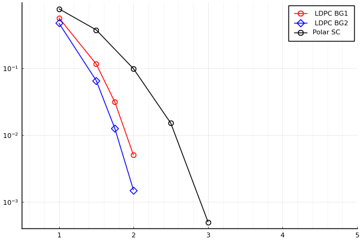

# NR channel coding

This project is about LDPC (Low-Density Parity-Check) codes and Polar codes. LDPC and Polar codes are powerful error correction techniques widely used in digital communication systems to improve the reliability of data transmission.

## Table of Contents

- [Introduction](#introduction)
- [Implementations](#implementations)
- [Perfrormance](#performance)
- [Usage](#usage)
- [Resources](#resources)

## Introduction

LDPC and Polar codes are two prominent types of error correction codes used in modern communication systems. LDPC codes are known for their excellent error correction capabilities and efficiency. Polar codes, on the other hand, provide a reliable method of achieving the channel capacity using a recursive construction. This project aims to provide implementations and resources to understand, implement, and experiment with these coding techniques.

## Implementations

This project contains implementations of LDPC and Polar codes in Java. Each implementation includes encoding, decoding functions and a simulation.

## Performance

Red Line: LDPC BG1, Z =24, rate = 1/2  
Blue Line: LDPC BG2, Z =52, rate = 1/2  
Black Line: Polar, N = 1024, K = 512

## Usage

1. Clone the repository to you own computer.
2. Open the file "Ldpc.java" or "Polar.java".
3. ctrl + f and search for "***".
4. Follow the instructions written in the comments and change your variables.
5. Run and wait for results in the terminal.

## Resources

This project is based on this YouTube playlist: 